# Forensic Dossier — Rumaila Prison / Investigation Section, Raqqa (ISIS)

**Generated:** 2026-03-21 10:37 UTC | **Argus v3.0** | **Nodes:** 69 | **Edges:** 91

---

## I. Incident Abstract

Talal Mustafa al-Shuweimi, a 45-year-old resident of Raqqa, was arrested **28 times** by ISIS between 2014 and 2017. During his most severe detention at the Investigation Section (Sajiyah Street / Hittin School intersection, Raqqa), Abu Seif Maqs — real name Mustafa al-Hamid al-Muslih — beat al-Shuweimi with sticks and metal rods for 3 consecutive days, hung him from the wall in *shabeh* [suspension] position for 18 days during summer heat, dragged him by his beard while shackled, and choked him by lifting him by the neck 20-30 cm off the ground. Abu Seif Maqs broke al-Shuweimi's ribs, causing lasting chest pain. Seven prisoners, including al-Shuweimi and Ibrahim al-Fakkash (al-Bariwi), were sentenced to *qisas* [execution by retribution]. ISIS confiscated all of al-Shuweimi's property — gold, silver, cars, and inherited farmland — under a *sharia* ruling.

**Cross-regime links discovered:** Abu Hudhayfa (Mahmoud al-Shahada), who assaulted al-Shuweimi at the Water Department, was previously detained in Assad regime's Sednaya Military Prison (~2000) before becoming an ISIS emir. Abu Humam (Issa, Jais clan), who served as Hisba emir on Sajiyah Street, was formerly a sergeant in Assad regime's Political Security branch.

---

## II. Evidence Sub-Graph

```mermaid
graph TD
    Talal_Mustafa_al_Shuweimi["Talal Mustafa al Shuweimi"] -->|DETAINED_AT| POINT_11_GOVERNORS_PALACE["POINT 11 GOVERNORS PALACE"]
    Talal_Mustafa_al_Shuweimi["Talal Mustafa al Shuweimi"] -->|DETAINED_AT| MILITARY_JUDICIARY_BUILDING_RAQQA["MILITARY JUDICIARY BUILDING RAQQA"]
    Talal_Mustafa_al_Shuweimi["Talal Mustafa al Shuweimi"] -->|DETAINED_AT| INVESTIGATION_SECTION_RAQQA["INVESTIGATION SECTION RAQQA"]
    Talal_Mustafa_al_Shuweimi["Talal Mustafa al Shuweimi"] -->|DETAINED_AT| PANORAMA_HISBA_BASE["PANORAMA HISBA BASE"]
    Talal_Mustafa_al_Shuweimi["Talal Mustafa al Shuweimi"] -->|DETAINED_AT| HISBA_SAJIYAH_STREET["HISBA SAJIYAH STREET"]
    Talal_Mustafa_al_Shuweimi["Talal Mustafa al Shuweimi"] -->|DETAINED_AT| JAZIRA_JUNCTION_PRISON["JAZIRA JUNCTION PRISON"]
    Talal_Mustafa_al_Shuweimi["Talal Mustafa al Shuweimi"] -->|DETAINED_AT| RUMAILA_PRISON["RUMAILA PRISON"]
    Abu_Seif_Maqs["Abu Seif Maqs"] -->|PERPETRATED| EVT_TORTURE_BEATING_3DAYS["EVT TORTURE BEATING 3DAYS"]
    Abu_Seif_Maqs["Abu Seif Maqs"] -->|PERPETRATED| EVT_SHABEH_18DAYS["EVT SHABEH 18DAYS"]
    Abu_Seif_Maqs["Abu Seif Maqs"] -->|PERPETRATED| EVT_BEARD_DRAGGING_CHOKING["EVT BEARD DRAGGING CHOKING"]
    Abu_Seif_Maqs["Abu Seif Maqs"] -->|PERPETRATED| EVT_RIB_BREAKING["EVT RIB BREAKING"]
    Abu_Hudhayfa_Shahada["Abu Hudhayfa Shahada"] -->|PERPETRATED| EVT_ASSAULT_WATER_DEPT["EVT ASSAULT WATER DEPT"]
    Abu_Abdurrahman_Sahou["Abu Abdurrahman Sahou"] -->|PERPETRATED| EVT_LAKHDAR_BRAHIMI_KILLING["EVT LAKHDAR BRAHIMI KILLING"]
    Abu_Seif_Maqs["Abu Seif Maqs"] -->|PERPETRATED| EVT_ESCAPE_RECAPTURE["EVT ESCAPE RECAPTURE"]
    ISIS_SHARIA_JUDGE["ISIS SHARIA JUDGE"] -->|PERPETRATED| EVT_QISAS_SENTENCING["EVT QISAS SENTENCING"]
    EVT_SHABEH_18DAYS["EVT SHABEH 18DAYS"] -->|USED_METHOD| SHABEH_SUSPENSION["SHABEH SUSPENSION"]
    EVT_TORTURE_BEATING_3DAYS["EVT TORTURE BEATING 3DAYS"] -->|USED_METHOD| BEATING_STICKS_METAL_RODS["BEATING STICKS METAL RODS"]
    EVT_BEARD_DRAGGING_CHOKING["EVT BEARD DRAGGING CHOKING"] -->|USED_METHOD| CHOKING_NECK_LIFT["CHOKING NECK LIFT"]
    EVT_LAKHDAR_BRAHIMI_KILLING["EVT LAKHDAR BRAHIMI KILLING"] -->|USED_METHOD| LAKHDAR_BRAHIMI_WATER_HOSE["LAKHDAR BRAHIMI WATER HOSE"]
    EVT_ESCAPE_PUNISHMENT["EVT ESCAPE PUNISHMENT"] -->|USED_METHOD| CRUCIFIXION["CRUCIFIXION"]
    EVT_JAZIRA_CHAINING["EVT JAZIRA CHAINING"] -->|USED_METHOD| CHAIN_SHACKLING_26_LINKS["CHAIN SHACKLING 26 LINKS"]
    Abu_Hamza_al_Tunisi["Abu Hamza al Tunisi"] -->|COMMANDED| INVESTIGATION_SECTION_RAQQA["INVESTIGATION SECTION RAQQA"]
    Abu_Seif_Maqs["Abu Seif Maqs"] -->|HOLDS_ROLE| EMIR_SEARCH_INVESTIGATION["EMIR SEARCH INVESTIGATION"]
    Abu_Bishr["Abu Bishr"] -->|HOLDS_ROLE| EMIR_HISBA_PANORAMA["EMIR HISBA PANORAMA"]
    Abu_Humam["Abu Humam"] -->|HOLDS_ROLE| EMIR_HISBA_SAJIYAH["EMIR HISBA SAJIYAH"]
    Abu_Yousuf_Interrogator["Abu Yousuf Interrogator"] -->|HOLDS_ROLE| HEAD_INTERROGATOR_MJ["HEAD INTERROGATOR MJ"]
    Abu_Suhaib_al_Tunisi["Abu Suhaib al Tunisi"] -->|HOLDS_ROLE| SENIOR_OFFICER_MJ["SENIOR OFFICER MJ"]
    Talal_Mustafa_al_Shuweimi["Talal Mustafa al Shuweimi"] -->|CO_DETAINED| Ibrahim_al_Fakkash_Bariwi["Ibrahim al Fakkash Bariwi"]
    Talal_Mustafa_al_Shuweimi["Talal Mustafa al Shuweimi"] -->|CO_DETAINED| Ibrahim_Abu_Nashwa["Ibrahim Abu Nashwa"]
    Talal_Mustafa_al_Shuweimi["Talal Mustafa al Shuweimi"] -->|CO_DETAINED| Ibrahim_Ayyoub_Shantar["Ibrahim Ayyoub Shantar"]
    Talal_Mustafa_al_Shuweimi["Talal Mustafa al Shuweimi"] -->|CO_DETAINED| Bara_al_Hano["Bara al Hano"]
    Talal_Mustafa_al_Shuweimi["Talal Mustafa al Shuweimi"] -->|CO_DETAINED| Ramadan_al_Jassim["Ramadan al Jassim"]
    Talal_Mustafa_al_Shuweimi["Talal Mustafa al Shuweimi"] -->|CO_DETAINED| Ibrahim_al_Alkan["Ibrahim al Alkan"]
    EVT_SHABEH_18DAYS["EVT SHABEH 18DAYS"] -->|OCCURRED_AT| INVESTIGATION_SECTION_RAQQA["INVESTIGATION SECTION RAQQA"]
    EVT_TORTURE_BEATING_3DAYS["EVT TORTURE BEATING 3DAYS"] -->|OCCURRED_AT| INVESTIGATION_SECTION_RAQQA["INVESTIGATION SECTION RAQQA"]
    EVT_LAKHDAR_BRAHIMI_KILLING["EVT LAKHDAR BRAHIMI KILLING"] -->|OCCURRED_AT| MILITARY_JUDICIARY_BUILDING_RAQQA["MILITARY JUDICIARY BUILDING RAQQA"]
    EVT_ESCAPE_ATTEMPT["EVT ESCAPE ATTEMPT"] -->|OCCURRED_AT| HISBA_SAJIYAH_STREET["HISBA SAJIYAH STREET"]
    EVT_QISAS_SENTENCING["EVT QISAS SENTENCING"] -->|OCCURRED_AT| INVESTIGATION_SECTION_RAQQA["INVESTIGATION SECTION RAQQA"]
    EVT_JUDICIAL_POLICE_TRANSFER["EVT JUDICIAL POLICE TRANSFER"] -->|OCCURRED_AT| INVESTIGATION_SECTION_RAQQA["INVESTIGATION SECTION RAQQA"]
    EVT_JAZIRA_CHAINING["EVT JAZIRA CHAINING"] -->|OCCURRED_AT| JAZIRA_JUNCTION_PRISON["JAZIRA JUNCTION PRISON"]
    Abu_Hudhayfa_Shahada["Abu Hudhayfa Shahada"] -->|CROSS_REGIME_TRANSFER| SEDNAYA_MILITARY_PRISON["SEDNAYA MILITARY PRISON"]
    Abu_Humam["Abu Humam"] -->|CROSS_REGIME_TRANSFER| POLITICAL_SECURITY_BRANCH["POLITICAL SECURITY BRANCH"]
    Talal_Mustafa_al_Shuweimi["Talal Mustafa al Shuweimi"] -->|WITNESSED| EVT_QISAS_SENTENCING["EVT QISAS SENTENCING"]
    Talal_Mustafa_al_Shuweimi["Talal Mustafa al Shuweimi"] -->|WITNESSED| EVT_LAKHDAR_BRAHIMI_KILLING["EVT LAKHDAR BRAHIMI KILLING"]
    Talal_Mustafa_al_Shuweimi["Talal Mustafa al Shuweimi"] -->|WITNESSED| EVT_JUDICIAL_POLICE_TRANSFER["EVT JUDICIAL POLICE TRANSFER"]
    Talal_Mustafa_al_Shuweimi["Talal Mustafa al Shuweimi"] -->|WITNESSED| EVT_ESCAPE_ATTEMPT["EVT ESCAPE ATTEMPT"]
    Talal_Mustafa_al_Shuweimi["Talal Mustafa al Shuweimi"] -->|WITNESSED| EVT_JAZIRA_CHAINING["EVT JAZIRA CHAINING"]
    EVT_SHABEH_18DAYS["EVT SHABEH 18DAYS"] -->|TEMPORAL| SUMMER_2014["SUMMER 2014"]
    SENSORY_HEAT_ENDURED_BEATING["SENSORY HEAT ENDURED BEATING"] -->|SENSORY_AT| INVESTIGATION_SECTION_RAQQA["INVESTIGATION SECTION RAQQA"]
    SENSORY_FOUL_SMELL_DAMPNESS["SENSORY FOUL SMELL DAMPNESS"] -->|SENSORY_AT| RUMAILA_SOLITARY_CELLS["RUMAILA SOLITARY CELLS"]
    SENSORY_TORTURE_SOUNDS_CORRIDOR["SENSORY TORTURE SOUNDS CORRIDOR"] -->|SENSORY_AT| POINT_11_GOVERNORS_PALACE["POINT 11 GOVERNORS PALACE"]
    SENSORY_HOSE_STRIKING_BODY["SENSORY HOSE STRIKING BODY"] -->|SENSORY_AT| MILITARY_JUDICIARY_BUILDING_RAQQA["MILITARY JUDICIARY BUILDING RAQQA"]
    SENSORY_SWORDS_IN_VEHICLE["SENSORY SWORDS IN VEHICLE"] -->|SENSORY_AT| INVESTIGATION_SECTION_RAQQA["INVESTIGATION SECTION RAQQA"]
    SENSORY_CHAIN_SURVEILLANCE["SENSORY CHAIN SURVEILLANCE"] -->|SENSORY_AT| JAZIRA_JUNCTION_PRISON["JAZIRA JUNCTION PRISON"]
    SITE_VISIT_PRISON_ROOM["SITE VISIT PRISON ROOM"] -->|CORROBORATES| EVT_CHAIN_7_PRISONERS["EVT CHAIN 7 PRISONERS"]
    SITE_VISIT_SOLITARY["SITE VISIT SOLITARY"] -->|CORROBORATES| RUMAILA_SOLITARY_CELLS["RUMAILA SOLITARY CELLS"]
    SITE_VISIT_PRISON_ROOM["SITE VISIT PRISON ROOM"] -->|CORROBORATES| EVT_ESCAPE_ATTEMPT["EVT ESCAPE ATTEMPT"]
    Abu_Seif_Maqs["Abu Seif Maqs"] -->|MEMBER_OF| ISIS["ISIS"]
    Abu_Hudhayfa_Shahada["Abu Hudhayfa Shahada"] -->|MEMBER_OF| ISIS["ISIS"]
    Abu_Hamza_al_Tunisi["Abu Hamza al Tunisi"] -->|MEMBER_OF| ISIS["ISIS"]
    Abu_Humam["Abu Humam"] -->|MEMBER_OF| ISIS["ISIS"]
    Abu_Bishr["Abu Bishr"] -->|MEMBER_OF| ISIS["ISIS"]
    Abu_Abdurrahman_Sahou["Abu Abdurrahman Sahou"] -->|MEMBER_OF| ISIS["ISIS"]
    Abu_al_Yaman["Abu al Yaman"] -->|MEMBER_OF| ISIS["ISIS"]
    Abu_Saqr["Abu Saqr"] -->|MEMBER_OF| ISIS["ISIS"]
    ISIS_JUDICIAL_POLICE["ISIS JUDICIAL POLICE"] -->|MEMBER_OF| ISIS["ISIS"]
    HISBA["HISBA"] -->|MEMBER_OF| ISIS["ISIS"]
    ISIS_INFORMANTS["ISIS INFORMANTS"] -->|MEMBER_OF| ISIS["ISIS"]
    Abdul_Rahim_Shuweimi["Abdul Rahim Shuweimi"] -->|DETAINED_AT| SEDNAYA_MILITARY_PRISON["SEDNAYA MILITARY PRISON"]
    AIR_FORCE_INTELLIGENCE["AIR FORCE INTELLIGENCE"] -->|PERPETRATED| EVT_REGIME_DISMISSAL["EVT REGIME DISMISSAL"]
    ASSAD_REGIME["ASSAD REGIME"] -->|PERPETRATED| EVT_SEDNAYA_DETENTION_6YRS["EVT SEDNAYA DETENTION 6YRS"]
    EVT_REGIME_DISMISSAL["EVT REGIME DISMISSAL"] -->|TEMPORAL| T_2012["T 2012"]
    EVT_FIRST_ARREST_POINT11["EVT FIRST ARREST POINT11"] -->|TEMPORAL| T_2014_Q1["T 2014 Q1"]
    EVT_53DAY_DETENTION_MJ["EVT 53DAY DETENTION MJ"] -->|TEMPORAL| T_2014_Q1["T 2014 Q1"]
    EVT_ASSAULT_WATER_DEPT["EVT ASSAULT WATER DEPT"] -->|TEMPORAL| T_2014_MID["T 2014 MID"]
    EVT_TORTURE_BEATING_3DAYS["EVT TORTURE BEATING 3DAYS"] -->|TEMPORAL| SUMMER_2014["SUMMER 2014"]
    EVT_ESCAPE_ATTEMPT["EVT ESCAPE ATTEMPT"] -->|TEMPORAL| T_2014_2015["T 2014 2015"]
    EVT_QISAS_SENTENCING["EVT QISAS SENTENCING"] -->|TEMPORAL| T_2014_2015["T 2014 2015"]
    EVT_JUDICIAL_POLICE_TRANSFER["EVT JUDICIAL POLICE TRANSFER"] -->|TEMPORAL| T_RAMADAN["T RAMADAN"]
    EVT_JAZIRA_CHAINING["EVT JAZIRA CHAINING"] -->|TEMPORAL| T_3_5_MONTHS["T 3 5 MONTHS"]
    POINT_11_GOVERNORS_PALACE["POINT 11 GOVERNORS PALACE"] -->|OCCURRED_IN| RAQQA_CITY["RAQQA CITY"]
    INVESTIGATION_SECTION_RAQQA["INVESTIGATION SECTION RAQQA"] -->|OCCURRED_IN| RAQQA_CITY["RAQQA CITY"]
    RUMAILA_PRISON["RUMAILA PRISON"] -->|OCCURRED_IN| RAQQA_CITY["RAQQA CITY"]
    EVT_ASSAULT_WATER_DEPT["EVT ASSAULT WATER DEPT"] -->|OCCURRED_AT| RAQQA_WATER_DEPARTMENT["RAQQA WATER DEPARTMENT"]
    UNNAMED_VAN_DRIVER["UNNAMED VAN DRIVER"] -->|WITNESSED| EVT_LAKHDAR_BRAHIMI_KILLING["EVT LAKHDAR BRAHIMI KILLING"]
    Talal_Mustafa_al_Shuweimi["Talal Mustafa al Shuweimi"] -->|CO_DETAINED| UNNAMED_SHEIK_HEALER["UNNAMED SHEIK HEALER"]
    EVT_PROPERTY_SEIZURE["EVT PROPERTY SEIZURE"] -->|OCCURRED_AT| Abu_Sateef["Abu Sateef"]
    SHABEH_SUSPENSION["SHABEH SUSPENSION"] -->|CROSS_WITNESS| AL_BURJ_PRISON["AL BURJ PRISON"]
    CRUCIFIXION["CRUCIFIXION"] -->|CROSS_WITNESS| AL_BURJ_PRISON["AL BURJ PRISON"]
    HISBA["HISBA"] -->|CROSS_WITNESS| AL_BURJ_PRISON["AL BURJ PRISON"]
    ISIS["ISIS"] -->|CROSS_WITNESS| AL_BURJ_PRISON["AL BURJ PRISON"]
```

---

## III. Corroboration Matrix

| Entity | Type | Degree | Tier | Source Atoms |
|--------|------|--------|------|-------------|
| Talal Mustafa al-Shuweimi | PERSON | 19 | `CONVERGENT` | ATOM_004, ATOM_005, ATOM_006, ATOM_010, ATOM_014 |
| Hisba / Investigation Section, Raqqa | FACILITY | 9 | `CONVERGENT` | ATOM_013, ATOM_014, ATOM_015, ATOM_016, ATOM_033 |
| Abu Seif Maqs (Mustafa al-Hamid al-Muslih, Wahb clan) | PERSON | 7 | `CONVERGENT` | ATOM_012, ATOM_014, ATOM_015, ATOM_016, ATOM_031 |
| EVT LAKHDAR BRAHIMI KILLING | EVENT | 5 | `CONVERGENT` | ATOM_026 |
| EVT TORTURE BEATING 3DAYS | EVENT | 4 | `CORROBORATED` | ATOM_014 |
| EVT SHABEH 18DAYS | EVENT | 4 | `CORROBORATED` | ATOM_014 |
| EVT QISAS SENTENCING | EVENT | 4 | `CORROBORATED` | ATOM_020, ATOM_033 |
| EVT JAZIRA CHAINING | EVENT | 4 | `CORROBORATED` | ATOM_037 |
| EVT ESCAPE ATTEMPT | EVENT | 4 | `CORROBORATED` | ATOM_028, ATOM_042 |
| Raqqa Province, Sajiyah Street | FACILITY | 3 | `CORROBORATED` | ATOM_004, ATOM_013, ATOM_017 |
| Point 11, former Governor's Palace, Raqqa | FACILITY | 3 | `CORROBORATED` | ATOM_004, ATOM_027 |
| Old Military Judiciary building near National Hospital, Raqqa | FACILITY | 3 | `CORROBORATED` | ATOM_005, ATOM_006, ATOM_026 |
| Abu Hudhayfa (Mahmoud al-Shahada, Ghanem al-Zahir clan) | PERSON | 3 | `CORROBORATED` | ATOM_008, ATOM_009 |
| Abu Humam (Issa, Jais clan) | PERSON | 3 | `CORROBORATED` | ATOM_021 |
| Jazira Junction prison (small room with toilet) | FACILITY | 3 | `CORROBORATED` | ATOM_037 |
| EVT ASSAULT WATER DEPT | EVENT | 3 | `CORROBORATED` | ATOM_008 |
| EVT JUDICIAL POLICE TRANSFER | EVENT | 3 | `CORROBORATED` | ATOM_034 |
| Sednaya Military Prison | FACILITY | 2 | `SUPPORTED` | ATOM_003, ATOM_009 |
| Abu Abdurrahman (Mahmoud al-Ali al-Sahou, Ghanem al-Zahir clan, from Jaif area) | PERSON | 2 | `SUPPORTED` | ATOM_007, ATOM_026 |
| Abu Bishr (Saudi national) | PERSON | 2 | `SUPPORTED` | ATOM_011 |

> **Note:** All entities are currently `UNCORROBORATED` or `SUPPORTED` because this is a **single-witness analysis**. Cross-referencing with other سجن الرميلة witnesses will upgrade corroboration tiers.

---

## IV. Entity Registry

| ID | Type | Name | First Seen In | Score | Tier |
|----|------|------|---------------|-------|------|
| EVT_TORTURE_BEATING_3DAYS | EVENT | EVT TORTURE BEATING 3DAYS |  | 4 | `CORROBORATED` |
| EVT_SHABEH_18DAYS | EVENT | EVT SHABEH 18DAYS |  | 4 | `CORROBORATED` |
| EVT_BEARD_DRAGGING_CHOKING | EVENT | EVT BEARD DRAGGING CHOKING |  | 2 | `SUPPORTED` |
| EVT_RIB_BREAKING | EVENT | EVT RIB BREAKING |  | 1 | `UNCORROBORATED` |
| EVT_ASSAULT_WATER_DEPT | EVENT | EVT ASSAULT WATER DEPT |  | 3 | `CORROBORATED` |
| EVT_LAKHDAR_BRAHIMI_KILLING | EVENT | EVT LAKHDAR BRAHIMI KILLING |  | 5 | `CONVERGENT` |
| EVT_ESCAPE_RECAPTURE | EVENT | EVT ESCAPE RECAPTURE |  | 1 | `UNCORROBORATED` |
| EVT_QISAS_SENTENCING | EVENT | EVT QISAS SENTENCING |  | 4 | `CORROBORATED` |
| EVT_ESCAPE_PUNISHMENT | EVENT | EVT ESCAPE PUNISHMENT |  | 1 | `UNCORROBORATED` |
| EVT_JAZIRA_CHAINING | EVENT | EVT JAZIRA CHAINING |  | 4 | `CORROBORATED` |
| EVT_ESCAPE_ATTEMPT | EVENT | EVT ESCAPE ATTEMPT |  | 4 | `CORROBORATED` |
| EVT_JUDICIAL_POLICE_TRANSFER | EVENT | EVT JUDICIAL POLICE TRANSFER |  | 3 | `CORROBORATED` |
| EVT_CHAIN_7_PRISONERS | EVENT | EVT CHAIN 7 PRISONERS |  | 1 | `UNCORROBORATED` |
| EVT_REGIME_DISMISSAL | EVENT | EVT REGIME DISMISSAL |  | 2 | `SUPPORTED` |
| EVT_SEDNAYA_DETENTION_6YRS | EVENT | EVT SEDNAYA DETENTION 6YRS |  | 1 | `UNCORROBORATED` |
| EVT_FIRST_ARREST_POINT11 | EVENT | EVT FIRST ARREST POINT11 |  | 1 | `UNCORROBORATED` |
| EVT_53DAY_DETENTION_MJ | EVENT | EVT 53DAY DETENTION MJ |  | 1 | `UNCORROBORATED` |
| EVT_PROPERTY_SEIZURE | EVENT | EVT PROPERTY SEIZURE |  | 1 | `UNCORROBORATED` |
| RAQQA_CITY | FACILITY | Raqqa Province, Sajiyah Street | 01_تعريف-ملخص القصة_En.srt | 3 | `CORROBORATED` |
| RAQQA_WATER_DEPARTMENT | FACILITY | Raqqa, Water Department | 01_تعريف-ملخص القصة_En.srt | 1 | `UNCORROBORATED` |
| SEDNAYA_MILITARY_PRISON | FACILITY | Sednaya Military Prison | 01_تعريف-ملخص القصة_En.srt | 2 | `SUPPORTED` |
| POINT_11_GOVERNORS_PALACE | FACILITY | Point 11, former Governor's Palace, Raqqa | 01_تعريف-ملخص القصة_En.srt | 3 | `CORROBORATED` |
| MILITARY_JUDICIARY_BUILDING_RAQQA | FACILITY | Old Military Judiciary building near National Hospital, Raqqa | 01_تعريف-ملخص القصة_En.srt | 3 | `CORROBORATED` |
| PANORAMA_HISBA_BASE | FACILITY | 16th Street, Raqqa → Panorama Hisba base (Maqs Roundabout) | 01_تعريف-ملخص القصة_En.srt | 1 | `UNCORROBORATED` |
| INVESTIGATION_SECTION_RAQQA | FACILITY | Hisba / Investigation Section, Raqqa | 01_تعريف-ملخص القصة_En.srt | 9 | `CONVERGENT` |
| RUMAILA_PRISON | FACILITY | Investigation Section / Rumaila Prison | 07_محاولة الهروب من السجن_En.srt | 2 | `SUPPORTED` |
| HISBA_SAJIYAH_STREET | FACILITY | Hisba base, Sajiyah Street / Atiya Bakery Street | 02_الاعتقال_En.srt | 2 | `SUPPORTED` |
| JAZIRA_JUNCTION_PRISON | FACILITY | Jazira Junction prison (small room with toilet) | 10_وصف سجن مفرق الجزرة_En.srt | 3 | `CORROBORATED` |
| RUMAILA_SOLITARY_CELLS | FACILITY | Rumaila Prison, solitary cell wing | خارجي/04_Solitary Confinement_En.srt | 2 | `SUPPORTED` |
| SHABEH_SUSPENSION | METHOD | SHABEH SUSPENSION |  | 2 | `SUPPORTED` |
| BEATING_STICKS_METAL_RODS | METHOD | BEATING STICKS METAL RODS |  | 1 | `UNCORROBORATED` |
| CHOKING_NECK_LIFT | METHOD | CHOKING NECK LIFT |  | 1 | `UNCORROBORATED` |
| AIR_FORCE_INTELLIGENCE | ORGANIZATION | Assad regime (Air Force Intelligence) | 01_تعريف-ملخص القصة_En.srt | 1 | `UNCORROBORATED` |
| ASSAD_REGIME | ORGANIZATION | Assad regime | 01_تعريف-ملخص القصة_En.srt | 1 | `UNCORROBORATED` |
| ISIS | ORGANIZATION | ISIS security members | 01_تعريف-ملخص القصة_En.srt | 12 | `CONVERGENT` |
| HISBA | ORGANIZATION | Hisba (religious police) | 01_تعريف-ملخص القصة_En.srt | 2 | `SUPPORTED` |
| ISIS_JUDICIAL_POLICE | ORGANIZATION | ISIS Judicial Police | 09_الشرطة القضائية_En.srt | 1 | `UNCORROBORATED` |
| Talal_Mustafa_al_Shuweimi | PERSON | Talal Mustafa al-Shuweimi | 01_تعريف-ملخص القصة_En.srt | 19 | `CONVERGENT` |
| Abdul_Rahim_Shuweimi | PERSON | Talal's brother (Abdul Rahim Shuweimi) | 01_تعريف-ملخص القصة_En.srt | 1 | `UNCORROBORATED` |
| Abu_Yousuf_Interrogator | PERSON | Abu Yousuf (Khameesi family, from Tabqa) | 01_تعريف-ملخص القصة_En.srt | 1 | `UNCORROBORATED` |
| Abu_Abdurrahman_Sahou | PERSON | Abu Abdurrahman (Mahmoud al-Ali al-Sahou, Ghanem al-Zahir clan, from Jaif area) | 04_التحقيق_En.srt | 2 | `SUPPORTED` |
| UNNAMED_VAN_DRIVER | PERSON | unnamed prisoner (van driver from Kalta area) | 04_التحقيق_En.srt | 1 | `UNCORROBORATED` |
| Abu_Hudhayfa_Shahada | PERSON | Abu Hudhayfa (Mahmoud al-Shahada, Ghanem al-Zahir clan) | 01_تعريف-ملخص القصة_En.srt | 3 | `CORROBORATED` |
| Abu_Bishr | PERSON | Abu Bishr (Saudi national) | 01_تعريف-ملخص القصة_En.srt | 2 | `SUPPORTED` |
| Abu_Seif_Maqs | PERSON | Abu Seif Maqs (Mustafa al-Hamid al-Muslih, Wahb clan) | 01_تعريف-ملخص القصة_En.srt | 7 | `CONVERGENT` |
| Abu_Hamza_al_Tunisi | PERSON | Abu Hamza al-Tunisi | 03_سجن التحري_En.srt | 2 | `SUPPORTED` |
| Ibrahim_al_Fakkash_Bariwi | PERSON | Ibrahim al-Fakkash (al-Bariwi, Shibli Salamah clan) | 07_محاولة الهروب من السجن_En.srt | 1 | `UNCORROBORATED` |
| Ibrahim_Abu_Nashwa | PERSON | Ibrahim Abu Nashwa (Ibrahim al-Ali al-Alkan) | 07_محاولة الهروب من السجن_En.srt | 1 | `UNCORROBORATED` |
| Ibrahim_Ayyoub_Shantar | PERSON | Ibrahim Ayyoub (Shantar) | 07_محاولة الهروب من السجن_En.srt | 1 | `UNCORROBORATED` |
| Abu_Humam | PERSON | Abu Humam (Issa, Jais clan) | 02_الاعتقال_En.srt | 3 | `CORROBORATED` |
| ISIS_INFORMANTS | PERSON | ISIS informants (Abdullah al-Bou Saraya, Abdullah al-Asaad) | 05_المحققين_En.srt | 1 | `UNCORROBORATED` |
| Abu_Suhaib_al_Tunisi | PERSON | Abu Suhaib al-Tunisi | 04_التحقيق_En.srt | 1 | `UNCORROBORATED` |
| Abu_al_Yaman | PERSON | Abu al-Yaman (from Aleppo Province) | 07_محاولة الهروب من السجن_En.srt | 1 | `UNCORROBORATED` |
| Bara_al_Hano | PERSON | Bara al-Hano | 07_محاولة الهروب من السجن_En.srt | 1 | `UNCORROBORATED` |
| ISIS_SHARIA_JUDGE | PERSON | ISIS Sharia Court judge | 08_العملية القضائية-_En.srt | 1 | `UNCORROBORATED` |
| Ramadan_al_Jassim | PERSON | Ramadan al-Jassim | خارجي/01_prison room_En.srt | 1 | `UNCORROBORATED` |
| Ibrahim_al_Alkan | PERSON | Ibrahim al-Alkan | 09_الشرطة القضائية_En.srt | 1 | `UNCORROBORATED` |
| Abu_Saqr | PERSON | Abu Saqr (al-Dabba family) | 10_وصف سجن مفرق الجزرة_En.srt | 1 | `UNCORROBORATED` |
| Abu_Sateef | PERSON | Abu Sateef (Kurdish homeowner) | 07_محاولة الهروب من السجن_En.srt | 1 | `UNCORROBORATED` |
| UNNAMED_SHEIK_HEALER | PERSON | Sheikh (traditional healer, Mansour Street, Raqqa) | 07_محاولة الهروب من السجن_En.srt | 1 | `UNCORROBORATED` |
| EMIR_SEARCH_INVESTIGATION | ROLE | EMIR SEARCH INVESTIGATION |  | 1 | `UNCORROBORATED` |
| EMIR_HISBA_PANORAMA | ROLE | EMIR HISBA PANORAMA |  | 1 | `UNCORROBORATED` |
| SENSORY_HEAT_ENDURED_BEATING | SENSORY | SENSORY HEAT ENDURED BEATING |  | 1 | `UNCORROBORATED` |
| SENSORY_FOUL_SMELL_DAMPNESS | SENSORY | SENSORY FOUL SMELL DAMPNESS |  | 1 | `UNCORROBORATED` |
| SENSORY_TORTURE_SOUNDS_CORRIDOR | SENSORY | SENSORY TORTURE SOUNDS CORRIDOR |  | 1 | `UNCORROBORATED` |
| SENSORY_HOSE_STRIKING_BODY | SENSORY | SENSORY HOSE STRIKING BODY |  | 1 | `UNCORROBORATED` |
| SENSORY_SWORDS_IN_VEHICLE | SENSORY | SENSORY SWORDS IN VEHICLE |  | 1 | `UNCORROBORATED` |
| SENSORY_CHAIN_SURVEILLANCE | SENSORY | SENSORY CHAIN SURVEILLANCE |  | 1 | `UNCORROBORATED` |
| SUMMER_2014 | TIMEFRAME | SUMMER 2014 |  | 2 | `SUPPORTED` |

---

## V. Temporal Reconstruction

| Period | Event |
|--------|-------|
| 2012 | Assad regime dismisses Talal from Water Department, labels him "terrorist" |
| ~2013 | FSA enters Raqqa; 6-7 months later ISIS enters |
| 2014 Q1 | **1st arrest:** ISIS detains Talal at Point 11 (Governor's Palace) for being "regime agent" — 1 week |
| 2014 Q1 | **Transfer:** Moved to Military Judiciary building near National Hospital — 53 days |
| 2014 Q1 | Released, cleared, given clearance card |
| 2014 | **Assault by Abu Hudhayfa:** Hair grabbed, head pressed on table at Water Department |
| 2014 | **Hisba arrest:** 4 days at Panorama base (Maqs Roundabout) for cigarette accusation |
| 2014 | **2nd arrest by Abu Seif Maqs:** 15 days, tortured and beaten |
| 2014 summer | **Investigation Section detention:** 3 days beating + 18 days *shabeh* + 53 days total. Ribs broken. |
| 2014-2017 | **28 total imprisonments**, most for cigarette trading (10-60 days each) |
| 2014/2015 | **Qisas sentence:** 7 prisoners including Talal sentenced to execution |

---

## VI. Human Gate Queue (⚠️ Pending Approval)

| Edge | Type | Assertion | Approved |
|------|------|-----------|----------|
| EDGE_005 | `PERPETRATED` | Abu_Seif_Maqs → EVT_TORTURE_BEATING_3DAYS | ❌ Pending |
| EDGE_006 | `PERPETRATED` | Abu_Seif_Maqs → EVT_SHABEH_18DAYS | ❌ Pending |
| EDGE_007 | `PERPETRATED` | Abu_Seif_Maqs → EVT_BEARD_DRAGGING_CHOKING | ❌ Pending |
| EDGE_008 | `PERPETRATED` | Abu_Seif_Maqs → EVT_RIB_BREAKING | ❌ Pending |
| EDGE_009 | `PERPETRATED` | Abu_Hudhayfa_Shahada → EVT_ASSAULT_WATER_DEPT | ❌ Pending |
| EDGE_009B | `PERPETRATED` | Abu_Abdurrahman_Sahou → EVT_LAKHDAR_BRAHIMI_KILLING | ❌ Pending |
| EDGE_009C | `PERPETRATED` | Abu_Seif_Maqs → EVT_ESCAPE_RECAPTURE | ❌ Pending |
| EDGE_009D | `PERPETRATED` | ISIS_SHARIA_JUDGE → EVT_QISAS_SENTENCING | ❌ Pending |
| EDGE_013 | `COMMANDED` | Abu_Hamza_al_Tunisi → INVESTIGATION_SECTION_RAQQA | ❌ Pending |
| EDGE_021 | `CROSS_REGIME_TRANSFER` | Abu_Hudhayfa_Shahada → SEDNAYA_MILITARY_PRISON | ❌ Pending |
| EDGE_022 | `CROSS_REGIME_TRANSFER` | Abu_Humam → POLITICAL_SECURITY_BRANCH | ❌ Pending |
| EDGE_041 | `PERPETRATED` | AIR_FORCE_INTELLIGENCE → EVT_REGIME_DISMISSAL | ❌ Pending |
| EDGE_042 | `PERPETRATED` | ASSAD_REGIME → EVT_SEDNAYA_DETENTION_6YRS | ❌ Pending |

---

## VII. Chain of Custody

| File | SHA-256 | Size |
|------|---------|------|
| طلال الشويمي-English.docx | `d4114fefcf0a38b8...` | 84 KB |
| 00_الفيديو كامل-Arabic.srt | `db7007060f4647f2...` | 147 KB |
| 00_الفيديو كامل-En.srt | `e9af404a9f54b327...` | 120 KB |
| 00_الفيديو كامل-Vimeo_ar.srt | `694bad0a1e9bd52d...` | 108 KB |
| 00_الفيديو كامل-Vimeo_en.srt | `ccf7d836febdc2ef...` | 89 KB |
| طلال الشويمي-English.docx | `d4114fefcf0a38b8...` | 84 KB |
| 01_prison room_En.srt | `9709acd25c256c8b...` | 4 KB |
| 02_the mothers house_En.srt | `2a36f5b5166e5ab9...` | 0 KB |
| 03_Archive office_En.srt | `1e5956510a0ec027...` | 1 KB |
| 04_Solitary Confinement_En.srt | `ec458f71f45120cd...` | 0 KB |
| 05_Entrance to the prison_En.srt | `8699312fc7bc625e...` | 1 KB |
| 00_الفيديو كامل_en.srt | `ccf7d836febdc2ef...` | 89 KB |
| 01_تعريف-ملخص القصة_En.srt | `75a450f32dfee6ee...` | 15 KB |
| 02_الاعتقال_En.srt | `784e5b39e5a794e4...` | 4 KB |
| 03_سجن التحري_En.srt | `9234ad74cb703197...` | 7 KB |

---

**[AUTH: ARGUS-DOSSIER | v3.0 | 2026-03-21 10:37 UTC]**
